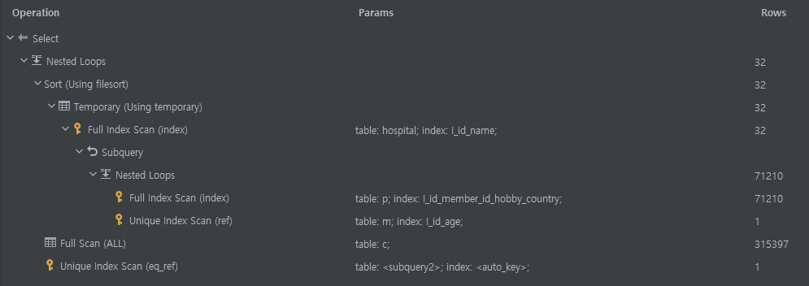
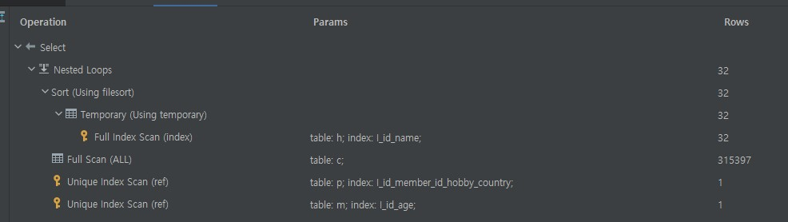

# 요구 사항

> 서울대병원에 다닌 20대 India 환자들을 병원에 머문 기간별로 집계하세요. (covid.Stay)


<br>

```sql
subway> select c.stay, count(c.id) as count
        from hospital
                 join covid c on hospital.id = c.hospital_id
        where hospital.name = '서울대병원'
          and c.programmer_id in
              (
                  select p.id
                  from programmer as p
                           join member m on p.member_id = m.id and m.age between 20 and 29
                  where country = 'India'
              )
        group by c.stay
[2021-11-21 21:40:39] 10 rows retrieved starting from 1 in 332 ms (execution: 323 ms, fetching: 9 ms)

```

- member id를 인덱스로 넣어주지 않으면 너무 오래 걸려서 먼저 추가해주고 시작했다.


- programmer(member_id), member(age)를 인덱스로 추가

```sql
subway> select c.stay, count(c.id) as count
        from hospital
                 join covid c on hospital.id = c.hospital_id
        where hospital.name = '서울대병원'
          and c.programmer_id in
              (
                  select p.id
                  from programmer as p
                           join member m on p.member_id = m.id and m.age between 20 and 29
                  where country = 'India'
              )
        group by c.stay
[2021-11-21 21:45:31] 10 rows retrieved starting from 1 in 206 ms (execution: 197 ms, fetching: 9 ms)
```

| id | select\_type | table | partitions | type | possible\_keys | key | key\_len | ref | rows | filtered | Extra |
| :--- | :--- | :--- | :--- | :--- | :--- | :--- | :--- | :--- | :--- | :--- | :--- |
| 1 | SIMPLE | hospital | NULL | ALL | I\_id | NULL | NULL | NULL | 32 | 10 | Using where; Using temporary; Using filesort |
| 1 | SIMPLE | c | NULL | ALL | NULL | NULL | NULL | NULL | 315397 | 10 | Using where; Using join buffer \(Block Nested Loop\) |
| 1 | SIMPLE | &lt;subquery2&gt; | NULL | eq\_ref | &lt;auto\_key&gt; | &lt;auto\_key&gt; | 9 | subway.c.programmer\_id | 1 | 100 | NULL |
| 2 | MATERIALIZED | p | NULL | index | I\_id\_member\_id\_hobby\_country | I\_id\_member\_id\_hobby\_country | 1300 | NULL | 71210 | 10 | Using where; Using index |
| 2 | MATERIALIZED | m | NULL | ref | I\_id\_age | I\_id\_age | 5 | subway.p.member\_id | 1 | 11.11 | Using where; Using index |

<br>

- hospital.name을 varchar로 수정

```sql
subway> select c.stay, count(c.id) as count
        from hospital
                 join covid c on hospital.id = c.hospital_id
        where hospital.name = '서울대병원'
          and c.programmer_id in
              (
                  select p.id
                  from programmer as p
                           join member m on p.member_id = m.id and m.age between 20 and 29
                  where country = 'India'
              )
        group by c.stay
[2021-11-21 21:50:18] 10 rows retrieved starting from 1 in 185 ms (execution: 176 ms, fetching: 9 ms)
```

| id | select\_type | table | partitions | type | possible\_keys | key | key\_len | ref | rows | filtered | Extra |
| :--- | :--- | :--- | :--- | :--- | :--- | :--- | :--- | :--- | :--- | :--- | :--- |
| 1 | SIMPLE | hospital | NULL | index | I\_id\_name | I\_id\_name | 1028 | NULL | 32 | 10 | Using where; Using index; Using temporary; Using filesort |
| 1 | SIMPLE | c | NULL | ALL | NULL | NULL | NULL | NULL | 315397 | 10 | Using where; Using join buffer \(Block Nested Loop\) |
| 1 | SIMPLE | &lt;subquery2&gt; | NULL | eq\_ref | &lt;auto\_key&gt; | &lt;auto\_key&gt; | 9 | subway.c.programmer\_id | 1 | 100 | NULL |
| 2 | MATERIALIZED | p | NULL | index | I\_id\_member\_id\_hobby\_country | I\_id\_member\_id\_hobby\_country | 1300 | NULL | 71210 | 10 | Using where; Using index |
| 2 | MATERIALIZED | m | NULL | ref | I\_id\_age | I\_id\_age | 5 | subway.p.member\_id | 1 | 11.11 | Using where; Using index |


<br>

- 서브 쿼리로 가져오던 programmer와 member의 부분을 inner join으로 변경해보았다.

```sql
subway> select c.stay, count(*) as count
        from covid c
                 join hospital h on c.hospital_id = h.id and h.name = '서울대병원'
                 join member m on c.member_id = m.id and m.age between 20 and 29
                 join programmer p on c.programmer_id = p.id and p.country = 'India'
        group by c.stay
[2021-11-21 22:11:48] 10 rows retrieved starting from 1 in 139 ms (execution: 128 ms, fetching: 11 ms)
```

| id | select\_type | table | partitions | type | possible\_keys | key | key\_len | ref | rows | filtered | Extra |
| :--- | :--- | :--- | :--- | :--- | :--- | :--- | :--- | :--- | :--- | :--- | :--- |
| 1 | SIMPLE | h | NULL | index | I\_id\_name | I\_id\_name | 1028 | NULL | 32 | 10 | Using where; Using index; Using temporary; Using filesort |
| 1 | SIMPLE | c | NULL | ALL | NULL | NULL | NULL | NULL | 315397 | 10 | Using where; Using join buffer \(Block Nested Loop\) |
| 1 | SIMPLE | p | NULL | ref | I\_id\_member\_id\_hobby\_country | I\_id\_member\_id\_hobby\_country | 9 | subway.c.programmer\_id | 1 | 10 | Using where; Using index |
| 1 | SIMPLE | m | NULL | ref | I\_id\_age | I\_id\_age | 5 | subway.c.member\_id | 1 | 11.11 | Using where; Using index |

- 기존에 서브 쿼리 방식에서는 programmer가 풀 인덱스 스캔을 타는 반면 조인 방식으로 통해 c.programmer_id 조건절을 타게 되는 경우 인덱스 스캔을 탄다.

<br>

<p align=center>
 
</p>
